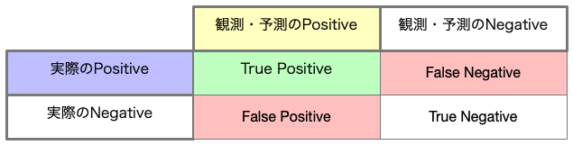
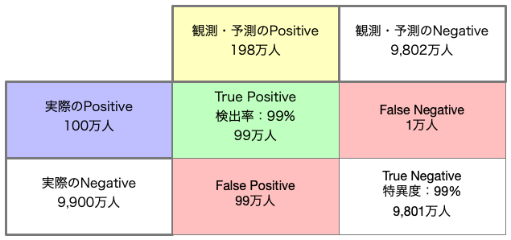
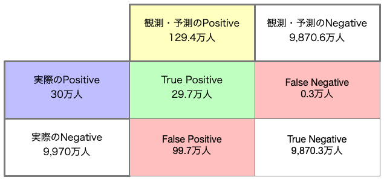
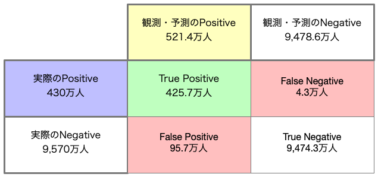
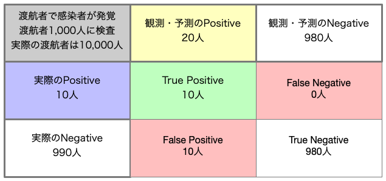
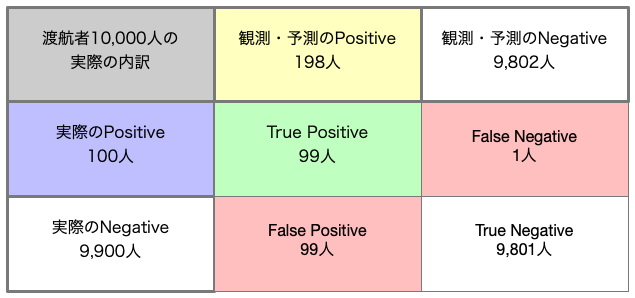
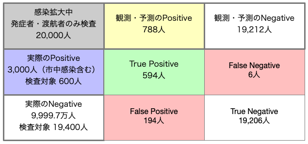
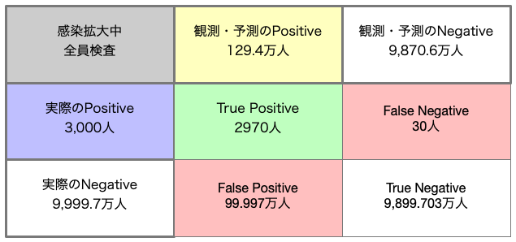
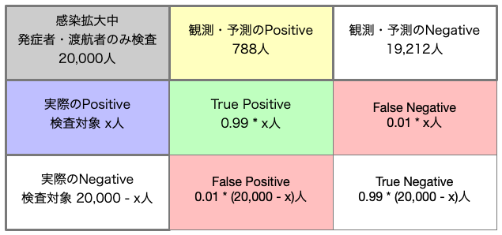

2020年を振り返るとやはりCOVID19の影響が大きかったと言えます。連日テレビ番組やネットニュースなどで取り上げられ、その中でもPCR検査とその結果や感染者数・重傷者数が毎日のように目につく状態が続きました。ここではその流れの中で人々に馴染みになったであろう、偽陽性という言葉に関する図を取り上げたいと思います。

# Confusion Matrix (混同行列)とは

偽陽性とはなんでしょうか？言葉通り偽の陽性です。では陽性とはなんでしょうか？英語ではPositive（＋とも表記）です。陽性とは想定している状態であることを示す言葉で、病気であれば罹患している状態や感染している状態を陽性、そうで無い状態を陰性（Negative、-）と呼んでいます。なので、目的となる状態が明確に決まっている前提で使われる言葉です。

ただ、気をつけないといけないのは、陽性といっても実際に罹患している状態を陽性と表現しますし、検査で判定された結果も陽性と表現されます。これらは同じ陽性ですが、現実には異なっています。検査の精度は100%ではないからです。検査によって、実際には罹患していないのに陽性と判定してしまうケースや、実際には罹患しているのに陰性と判定してしまうケースがあるわけです。そういったケースを説明するのにConfusion Matrixが使えます。



縦横は入れ替わるケースもありますが、行と列それぞれに実際と観測・予測のPositive、Negativeが並び、それらの掛け合わせでTrue Positive（真の陽性）、False Positive（偽陽性）、False Negative（偽陰性）、True Negative（真の陰性）が起こり得るという図になります。

# 使い道

この図は陽性、陰性に偽のモノが混じっているということを示しているにすぎません。しかしながらこの図に値や確率を入れることで様々な使い方ができます。

仮に１億人の人口の国があり、1%の人がある病気に罹患していて、その病気の罹患を検査する検査キットが検知率99%、特異度：99%で、全員検査をしたとします。その検査結果をConfusion Matrixにすると以下のようになります。



検査の結果、198万人に陽性が出ました。陽性である以上治療を施さなくてはいけませんが、実際のところどうなんでしょう？

Matrixでみると、198万人のうち、実際の罹患者は99万人であり、残りの99万人は罹患していなかったのです。さらにもっと悪いことに1万人は実際には罹患しているのに検査で陰性となってしまったため、治療を受けられないのです。この事実は検査の結果とかなり乖離があります。Confusion Matrixを使うとこういった真の内訳を見出すことに使えるわけです。

東京都の累積感染者数に基づくと大体感染率は人口の0.3%だそうです。仮にこの感染率で１億人の国があって、同じように全員検査をしたらどうなるでしょうか？



検査の結果、陽性者の割合はさっきの1%感染率の国に比べて減りました。129.4万人です。しかしよくみてみましょう。True Positiveは29.7万人に対して、False Positiveは99.7万人になってしまうのです。False Negativeは0.3万人ですから、こちらはよくなっていますが、偽陽性感染者がこんなに多いと医療関係の負担は全く軽くなりません。全体の感染率は低いのにも関わらず、です。

これはどういうことでしょうか？

実は全体の感染率（もちろんこれは後にならないと分からないのですが・・・）が低いと検査の結果はより当てにならなくなり、感染率が高くなるとよりマシになる傾向があります。アメリカ合衆国では何らかの要因で（ここでは本論でないので曖昧にしておきます）累積感染者の数から出した感染率は4.3%くらいです。１億人の国だと仮定して、全員検査してみましょう。それをConfusion Matrixに展開すると以下のようになります。



感染率が高くなっていますから、もちろん検査の結果の陽性者数はぐっと多くなります。しかしながらTrue Positiveが425.7万人に対してFalse Positiveは95.7万人ならずっとその割合は低くなることがわかります。こういった背景から感染率が高まったら全員検査までは行かなくても、検査する機会をできるだけ多くすることは合理的な判断といえます。

# ツールとして使う

本当の感染率は後になってみないと分かりませんし、全員検査でないとしたらどんな根拠で検査するの？といった問題があります。それ以外にも色々と複雑な要因があるのだから、Confusion Matrixにしたところで気休めではないか？といった声が聞こえてきそうですが、実際のところ全体のプロセスにおける１つのツールとして使うと有効に使えます。

感染率はその国民の遺伝的形質や生活習慣、発症時の処置の体制などによって潜在的にできあがりますが、ある日突然その割合の人が感染するわけではありません。時間を追って感染が拡がっていくのです。その時間を追ってというところがミソで、最初の感染者が見つかって以降にどのように対処したかで、最終的な感染者数や重傷者数、死亡者数が変わってきます。その時系列でのところどころでの判断にConfusion Matrixは使えるのです。

海外に渡航して帰国した人が発熱などの症状を訴え、調べたところ、新型のウィルスによる症状だと分かりました。これは海外で感染した疑いがあります。そこで直近の渡航者から1,000人に検査を行ったとしましょう。実際の渡航者は10,000人だったので、連絡のついた人、協力してくれた人だけの検査です。この時は渡航者のうち実際に感染していた人は10人だったとしましょう。以下のようになります。



陽性者が20人出たので全員特別な病院に収容しました。ここでのTrue Positiveは10人、False Positievは10人、False Negativeは0人でした。初期対応としてはまぁまぁではないでしょうか？仮に渡航者全員検査！となったらどうなっていたでしょうか？同じ割合の感染率として10,000人中100人が実際は感染していたとしましょう。以下のようになります。



10,000人を強制的に検査しました。その結果198人が陽性となり全員特別な病院に収容しました。病床や担当者の確保が大変でしたが、これで国内の感染は防げそうです・・・・と安心してよかったでしょうか？False PositiveがTrue Positiveと同じ99人で非常に高いと言えます。さらに致命的なことにFalse Negativeが１名と具体的な数字として現れてしまいました。もちろん、このことにはリアルタイムには見えてませんから、一部の専門家が「安心するな！」と言ったら当然反感をかいます。一方で強制検査をやらなかったとしたら、やはり99人中89人は検査に参加しなかった本当の感染者だったのでそれらの人は無感染者の扱いで生活を普通にして感染を広げることになります。

ここの数値は現実的には検査結果の陽性・陰性の数字以外は推定などでしか出せない数値です。だから広く一般に対して推測で説得するのは非常に困難です。しかしながら「こういう構造である」と知っている専門家ならば、これら推測でしか見えない数字をもとに対応策を考えることができるわけです。この検査キットの性能でこのくらいなら、False NegativeやFalse Positiveはどのくらいになるはずだから、こうすべきみたいに考えられるわけです。

その後市中感染などにより感染者が増えていったとしましょう。神のみぞ知る本当の感染者は1億人中3,000人だったとします。その時の発症者や渡航者はあわせて20,000人でした。この人たちを全員検査しましょう。神視点ですが、この中の実際の感染者数はちょっと高めの600人だったとします。



True Positiveで594人と出ました。繰り返しますが現場では陽性者788人なので788人を頑張って入院させてそのうちの本当の感染者が594人だったという結果です。頑張ったほうですが、それでも検査対象者の中で6人が本当は感染しているにも関わらず治療を受けていない状態になってしまっています。これも現実には見えません。それに本当の感染者数は3,000人であり、2,400人もの人がそもそも検査対象に入っていません。ただ、誰なのかが分からないのです。全員検査をやってみましょう。



全員検査をしたところ、陽性者はなんと129.4万人になりました。陽性と出た以上なんらかの対処が必要です。入院させるにも病床も医者も看護師もその他器具も全く足りません。それだけ頑張っても、大多数は感染していなかったうえ、30人もの感染者が処置を受けないままになります。これは良い判断とは言えません。

検査の性能が分かっていれば実際のPositive数は計算することも可能です。その計算結果がどのくらい信頼性があるかはまた別の話ですが、目安としては使えるはずです。



```
788 = 0.99x + 0.01(20000 -x)
788 = 0.98x + 200
0.98x = 588
x = 600
```

以上のように600人が実際の感染者だと推定できます。20,000人のうち600人が感染者だからこの病気は3%の確率で感染する病気だ！と断定するのは早計かもしれませんが、感染症対策のとっかかりにはなりそうです。

このようにConfusion Matrixは方針や指針をだすための判断材料を導き出すツールとして使えそうです。他にも利用方法はあるはずですが、ここでは以上で紹介とさせていただきます。