私自身は工学部出身のエンジニア・研究者をベースとした自社経営者なので、ちょっと普通の経営者の方とは数字の見方が違ってきます。ここではまだ確立された理論までは至っていませんが、ビジネスへの投資や構築を行っていく上で使えそうなアイディアを紹介します。図としては単純な線グラフですが、その数値の作り方がユニークです。

# 空想上の企業

ここである空想上の企業を想定しましょう。特定の企業ではありません。私がデータをある傾向にしたがって作ったものです。その企業の単期利益をグラフにすると以下のようになりました。

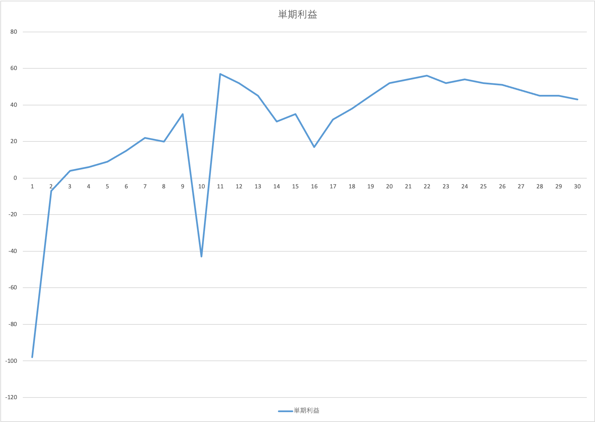

利益が酷く落ちた期が２回あります。大きな投資を２回やっているのか、なんらかの損失を被ったのでしょうか？実はこれは複数の商品を持つそこそこ長くやっている会社のグラフなのです。いかに部門別に出したグラフを示します。

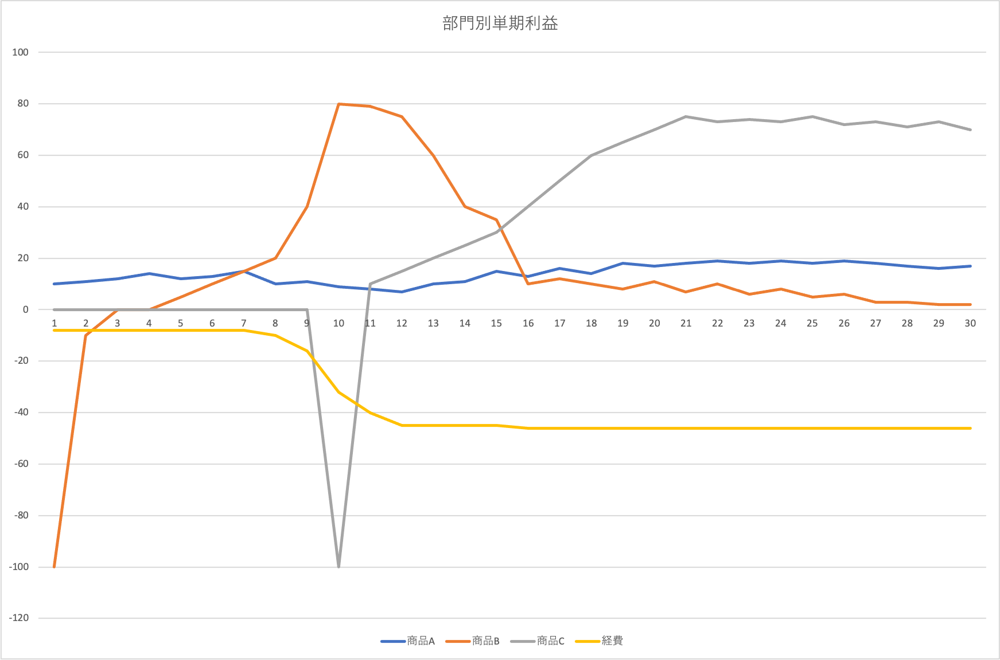

この会社の部門は以下の４つから成っています。

* 商品A：これまでずっと扱ってきた商品。完全に安定期に入っている。
* 商品B：このグラフの頭で思い切って投資をして開発した新商品。最近利益が落ちている。
* 商品C：商品Bの勢いにまかせてさらに新規に開発した商品。Bの反省を踏まえて売り上げ拡大速度を抑えた結果高い利益水準を維持している。
* 経費：全体としてかかっている費用。家賃や経営管理部門の人件費など。商品Bの成長に合わせて一時期急激に大きくなった。基本的に損益しかださない。

# 商品Bの分析

会社成長の起爆剤にはなったが、最近お荷物気味の商品Bに注目してみましょう。商品Bの単期利益の推移はすでに示した通りですが、実際のところ傾向としてどうなんでしょう？ここで本編のメインアイディアである、単期利益推移の速度、加速度、二次加速度、三次加速度をつかってみましょう。以下のグラフです。

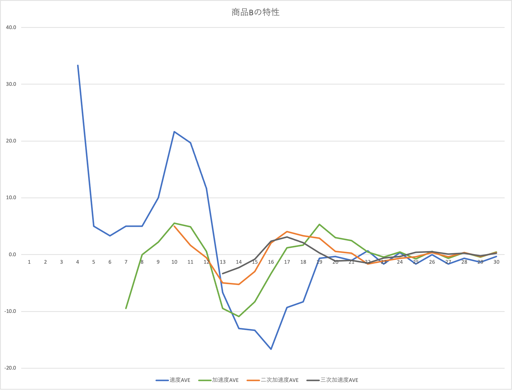

速度は単期利益の期別の値の差分をとって、さらに３期をならした移動平均をとっています。加速度は速度の差分、二次加速度は加速度の差分、三次加速度は二次加速度の差分でそれぞれ移動平均をとっています。速度は利益の変化ですからその商品の勢いが現れています。最初の勢いが急激に落ちたあと、一旦勢いがつきましたが、すぐに落ち込み、かなり低かったものの、そのあと０付近まで回復してそのまま推移しています。

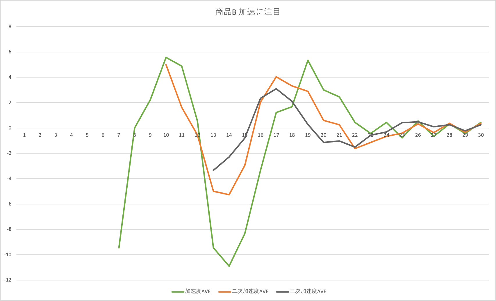

加速度以降に注目したグラフで見ると二次加速度も揺れてますから色々急激に変わることが起こったのでしょう。三次加速は大きい山ひとつのあと、小さい波になっていますから、大きな転換点が一つ（山が登って降っているから二つ？）あったようです。三次加速度も小さい波になりつつあるようですから、このまま変わらないのでしょうか？

# 商品Cの分析

商品Bの推移の反省を活かして画期的なアイディアではあるけど売り方の展開を抑制し着実に伸ばしたのが商品Cです。以下はその特性のグラフです。

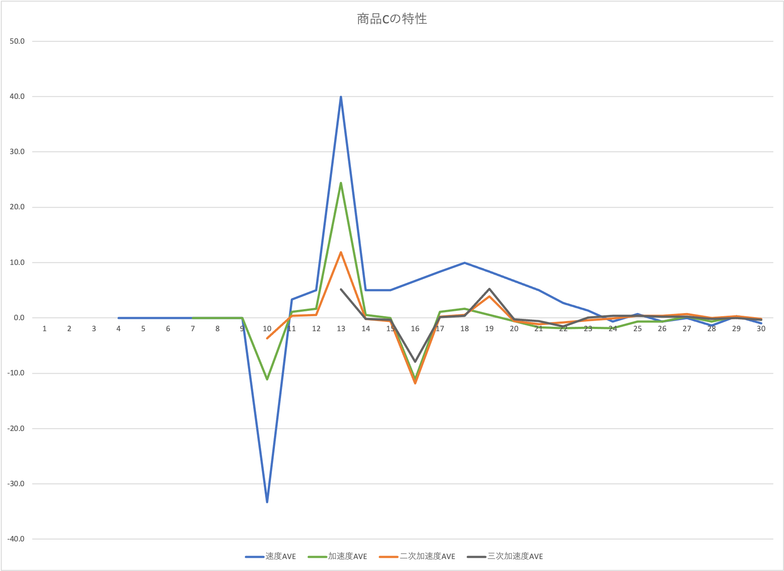

速度に着目すると最初の勢いのあと、マイナスになることもなく推移してはいますが、やはり速度はおちています。ここ最近は大きなプラス速度にはなれていません。このまま落ち着くのでしょうか？

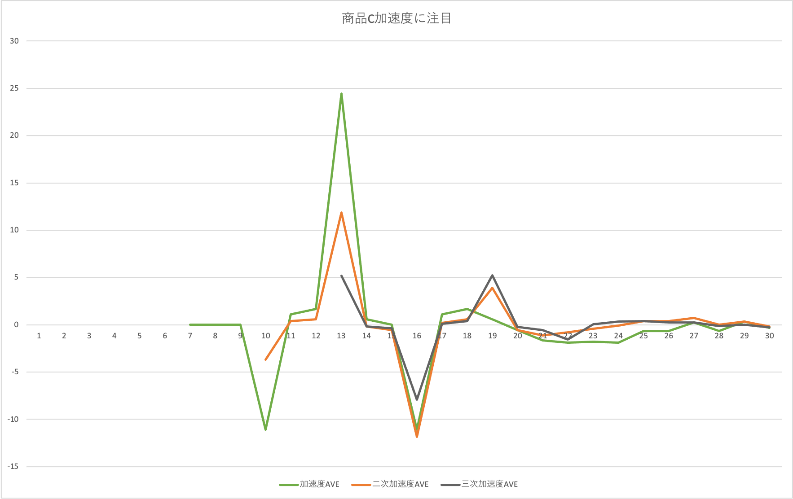

加速度に注目すると意外と落差があり、落ち方も激しかったようです。二次加速度も三次加速度も揺らぎ方はBと同じかもっと不安定にも見えなくはないです。

# 商品Bと商品Cの比較

ここで商品Bと商品Cを比較してみましょう。時間軸を投資時点からであわせています。

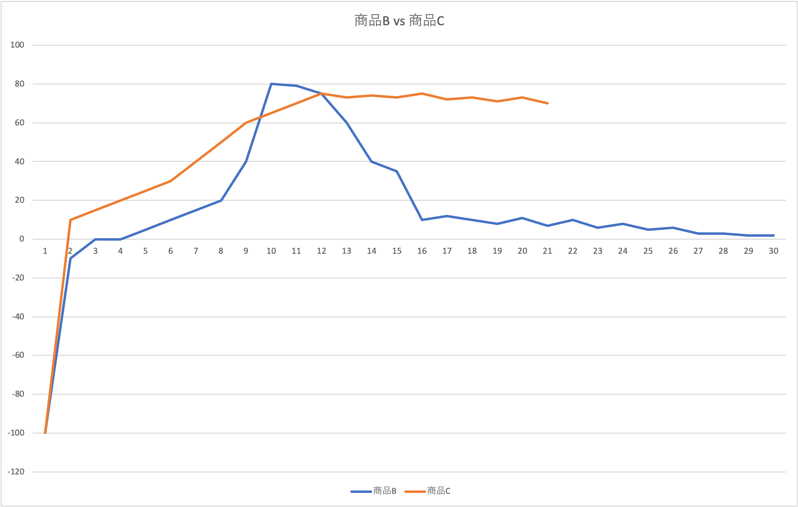

利益でみたら、商品Cのほうが優等生ですね。

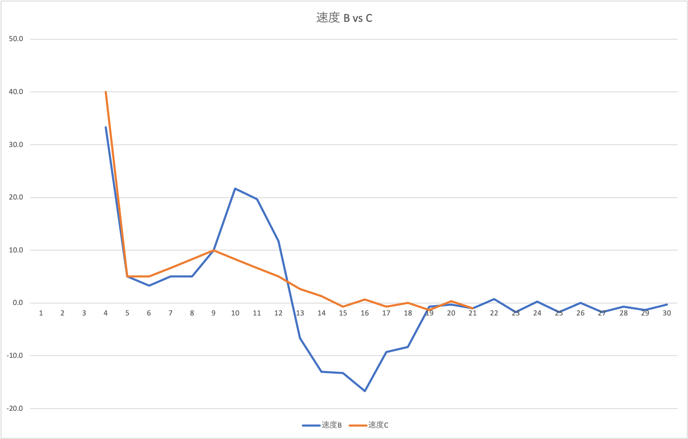

速度のグラフで見ると、商品Bはジェットコースターですが、商品Cは軟着陸しています。

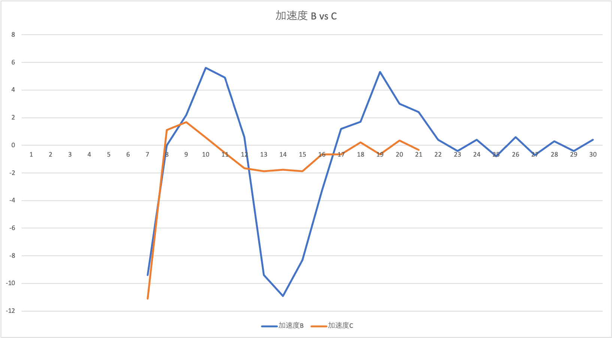

商品Cの安定度が見えますね。

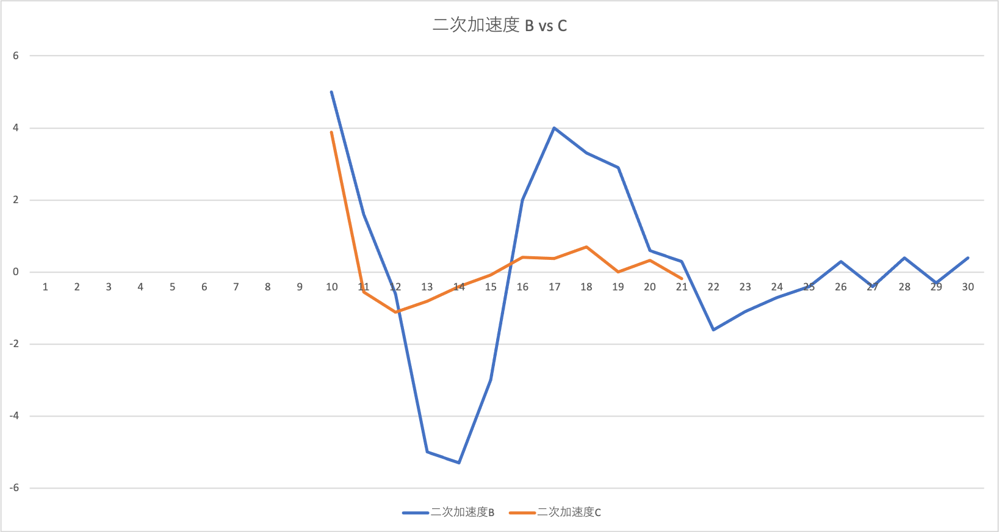

商品Cが堅実に伸ばした様子が伺えます。

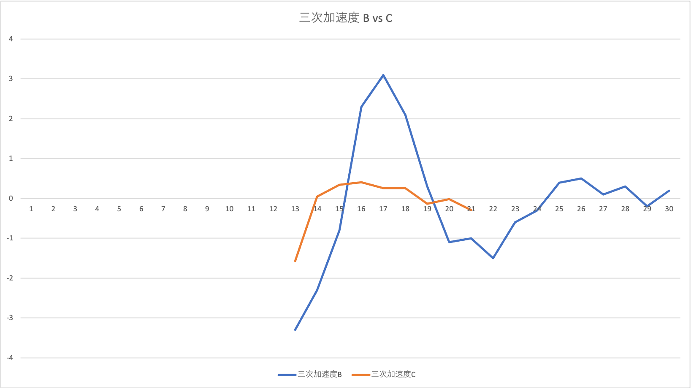

商品Bはまだ動きがありそうですが、逆に商品Cはこのまま落ち着くのでしょうか？

投資としては商品Cのほうがよかったように思われます。それならば、両者の未来を予測してみましょう。三次加速度は安定しつつあるように見えますから、直近６期分の三次加速度をそのまま繰り返す形でグラフを伸ばしてその単期利益がどうなるのかみてみましょう。三次加速度は二次加速度の差分、二次加速度は加速度の差分と連鎖していますから、三次加速度が決まると、単純に足し算するだけで利益の予測がでます。

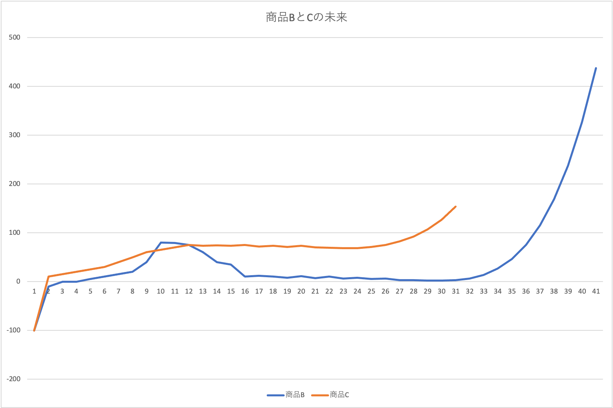

なんと、三次加速度の傾向を続けたら、どちらも今後急激に伸びる予測がでました！特にBの化方はすごいです。重荷だと思っていましたが、その判断は早計だったのかもしれません。

# 投資対象として

Bはこの後すごい勢いで伸びそうだとわかりましたが、実際Bをやるのは大変だったと思います。途中で大きく凹んでいますし、投資家としては非常に怖かったのではないでしょうか。そこで、Bの反省が事前にできていたとしてCだけ投資したらどうなっていたかをシミュレートしてみましょう。経費はBやCのために伸びましたから、その伸びの半分はCが貢献したこととして塩梅します。

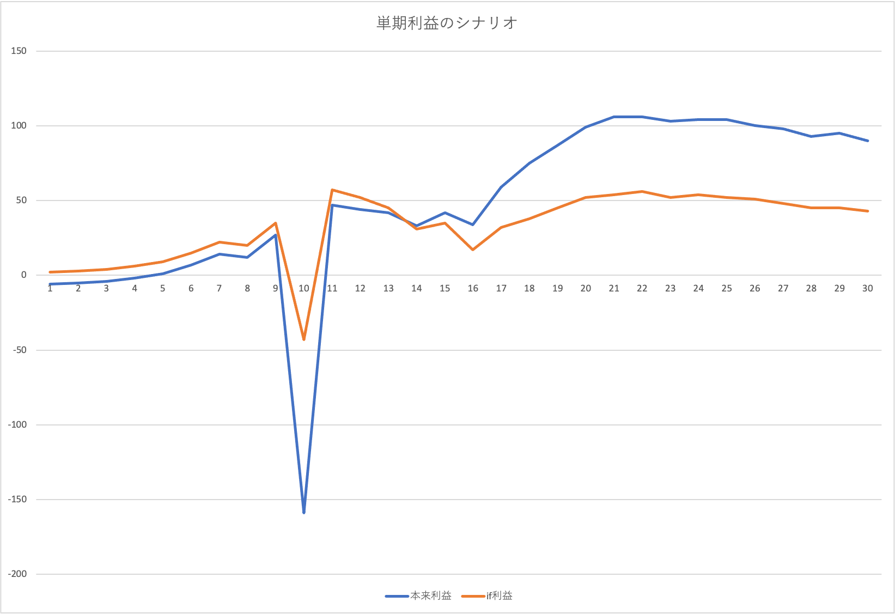

ここのグラフのオレンジがBをやらなかった利益推移です。もちろん、単純にBを抜いているだけですから相互に干渉するようなポイントの影響が抜けてしまっています。比較的大きな凹みを出さずにすんでいますね。うーーん最終的な利益は本来のほうがよいですが、凹むところを耐えられるでしょうか？

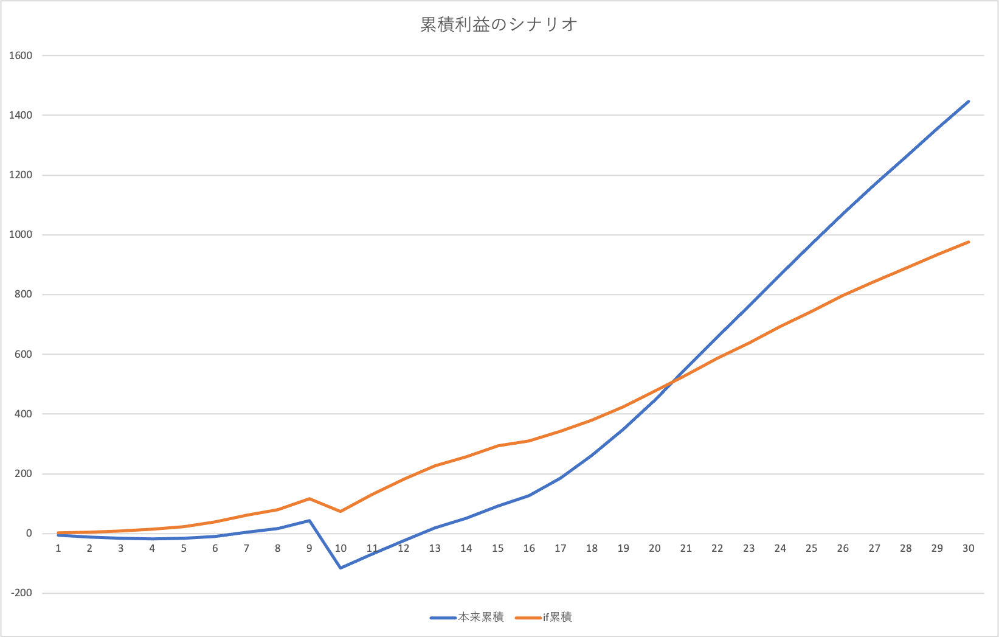

累積利益でみてみると、うーーんやはりBにもチャレンジした本来のシナリオのほうが投資のしがいがあるようです。

このように直近の利益水準だけでは分からないことが色々見える解析方法だと思っています。しかもほとんど四則演算だけですみます。部門ごとの単期ベースの粗利を出しておけばどこでも使える方法です。今後も研究をすすめていこうと思っています。